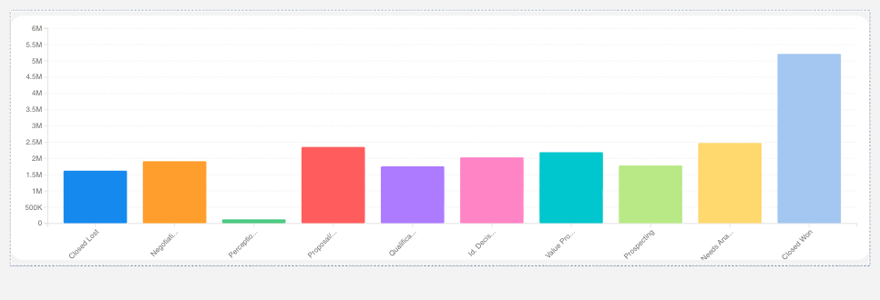

# Salesforce D3.js Chart Component Library

A complete suite of 30 Lightning Web Components (LWC) that wrap D3.js charts for use in Salesforce App Builder, Experience Builder, and Screen Flows. Components are drag-and-drop ready, capable of ingesting raw Salesforce record collections, and intelligently handle aggregation via server-side SOQL GROUP BY (preferred) or client-side JavaScript (fallback).

## 🖼️ Gallery

All charts below are rendered **live in Salesforce** (Lightning App Pages) against demo Opportunity data — not static mockups of the D3 output.

### Phase 3 — radial, ranking & timeline charts


_Pie, Horizontal Bar, Lollipop, Progress Bar, Diverging Bar, Waffle, Sunburst, Bubble, Chord Diagram, and Gantt._

### Phase 2 — distributions, flows & time series


_Funnel, Bullet, Stacked Bar, Area, Waterfall, Heatmap, Box Plot, Radar, Calendar Heatmap, and Sparkline Grid._

### Phase 1 — core analytics charts


_Gauge, Bar, Donut, Line, Scatter, Histogram, Treemap, Sankey, Force Graph, and Choropleth._

## ✨ Features

- **30 Chart Types**: Bar, Line, Donut, Gauge, Scatter, Histogram, Treemap, Sankey, Force Graph, Choropleth, Area, Stacked Bar, Funnel, Radar, Heatmap, Box Plot, Waterfall, Bullet, Calendar Heatmap, Sparkline Grid, Pie, Horizontal Bar, Lollipop, Progress Bar, Diverging Bar, Waffle, Sunburst, Bubble, Chord Diagram, Gantt
- **Drag-and-Drop Ready**: Fully configurable in Lightning App Builder
- **Server-Side Aggregation**: GROUP BY queries run in Apex, processing 50K+ records and sending pre-bucketed results to the browser
- **Dual Data Path**: Server-preferred when `objectApiName` is configured; client-side fallback for `recordCollection` and `soqlQuery`-only usage
- **GraphQL Self-Fetch** (bar chart): Opt-in `fetchMode="graphql"` fetches data declaratively via Salesforce's `lightning/graphql` wire adapter — no Apex controller required, FLS/sharing enforced by the platform
- **Server-Side Analytics**: Statistics (mean, median, stdDev) and correlation (Pearson r, linear regression) computed in Apex
- **Configurable Limits**: Per-chart `recordLimit` property in App Builder — set your own data ceiling or use smart defaults
- **Responsive**: Uses ResizeObserver for adaptive reflow
- **SLDS Styled**: Consistent with Salesforce Lightning Design System
- **Theme Support**: 4 built-in palettes + custom colors via JSON config
- **2,581 Tests**: Comprehensive Jest test coverage across 64 suites

## 📦 Components

### Phase 1

| Component           | Description          | Key Features                                   |
| ------------------- | -------------------- | ---------------------------------------------- |
| `c-d3-gauge`        | Single KPI gauge     | Zones, thresholds, color coding                |
| `c-d3-bar-chart`    | Aggregated bar chart | Vertical bars, drill-down, grid                |
| `c-d3-donut-chart`  | Part-to-whole        | Animated slices, center total, legend          |
| `c-d3-line-chart`   | Time series          | Multi-series, date parsing, curve types        |
| `c-d3-scatter-plot` | Correlation          | Trend line, Pearson coefficient, point sizing  |
| `c-d3-histogram`    | Distribution         | Auto-binning, normal curve overlay, statistics |
| `c-d3-treemap`      | Hierarchical         | Nested rectangles, zoom/drill, breadcrumbs     |
| `c-d3-sankey`       | Flow/process         | Nodes + links, gradient colors, flow values    |
| `c-d3-force-graph`  | Network graph        | Force simulation, drag, zoom/pan, node sizing  |
| `c-d3-choropleth`   | Geographic map       | US states, world, custom GeoJSON, color scales |

### Phase 2

| Component                | Description        | Key Features                                          |
| ------------------------ | ------------------ | ----------------------------------------------------- |
| `c-d3-area-chart`        | Filled time series | Stacked areas, gradients, multi-series                |
| `c-d3-stacked-bar-chart` | Multi-series bars  | Grouped or stacked, series comparison                 |
| `c-d3-funnel-chart`      | Conversion funnel  | Stage progression, drop-off rates                     |
| `c-d3-radar-chart`       | Multi-axis         | Polygon overlay, category comparison                  |
| `c-d3-heatmap`           | 2D categorical     | Color intensity grid, sequential ramps                |
| `c-d3-box-plot`          | Distribution stats | Quartiles, whiskers, outliers                         |
| `c-d3-waterfall-chart`   | Bridge/variance    | Running totals, positive/negative coloring            |
| `c-d3-bullet-chart`      | KPI vs target      | Actual vs target, qualitative ranges                  |
| `c-d3-calendar-heatmap`  | Daily data grid    | Year view, day-level color intensity                  |
| `c-d3-sparkline-grid`    | Small multiples    | Inline mini-charts, entity comparison, monthly rollup |

### Phase 3

| Component                   | Description          | Key Features                                         |
| --------------------------- | -------------------- | ---------------------------------------------------- |
| `c-d3-pie-chart`            | Part-to-whole        | Full-circle slices, legend, percentage labels        |
| `c-d3-horizontal-bar-chart` | Ranked categories    | Y-axis bands, long-label support, drill-down         |
| `c-d3-lollipop-chart`       | Ranked metrics       | Stem + circle, low ink, leaderboard style            |
| `c-d3-progress-bar`         | Single KPI vs target | Linear gauge, target marker, percentage fill         |
| `c-d3-diverging-bar-chart`  | Positive/negative    | Centered axis, semantic up/down coloring             |
| `c-d3-waffle-chart`         | Percentage grid      | 10×10 cells, contrast-aware labels, goal progress    |
| `c-d3-sunburst-chart`       | Radial hierarchy     | Concentric rings, two-level grouping, part-to-whole  |
| `c-d3-bubble-chart`         | Three-variable       | X/Y position + area-scaled size, category color      |
| `c-d3-chord-diagram`        | Relationship matrix  | Circular arcs, ribbons, bidirectional flow           |
| `c-d3-gantt-chart`          | Project timeline     | Time axis, date-range bars, today marker, drill-down |

## 🚀 Quick Start

### Prerequisites

- Salesforce CLI (`sf`)
- Node.js v20+ (v25 has compatibility issues with SF CLI)
- A Salesforce org with "Enable Local Development" turned on

### Installation

```bash
# Clone the repository
git clone https://github.com/weytani/d3-lwc.git
cd d3-lwc

# Install dependencies
npm install

# Deploy to your org
sf project deploy start --source-dir force-app -o <your-org-alias>
```

### Running Tests

```bash
npm test
```

### Local Development (Hot Reload)

```bash
# Use Node 20 for Salesforce CLI compatibility
export PATH="/opt/homebrew/opt/node@20/bin:$PATH"

# Start the Lightning Dev Server
sf lightning dev app -o <your-org-alias>
```

## 📊 Usage

### Common Properties (All Charts)

| Property           | Type     | Description                                                                      |
| ------------------ | -------- | -------------------------------------------------------------------------------- |
| `recordCollection` | Object[] | Data from Flow or parent component                                               |
| `soqlQuery`        | String   | SOQL query (used if recordCollection empty)                                      |
| `objectApiName`    | String   | SObject API name — enables server-side aggregation                               |
| `filterClause`     | String   | Optional WHERE clause for server aggregation                                     |
| `recordLimit`      | Integer  | Max records to process (1–10,000). Leave empty for smart defaults per chart type |
| `height`           | Integer  | Chart height in pixels                                                           |
| `theme`            | String   | Color theme (Salesforce Standard, Warm, Cool, Vibrant)                           |
| `advancedConfig`   | String   | JSON for advanced options                                                        |

### D3 Bar Chart (Server Aggregation)

```html
<!-- Server-side: aggregates across all matching records via SOQL GROUP BY -->
<c-d3-bar-chart
  object-api-name="Opportunity"
  group-by-field="StageName"
  value-field="Amount"
  operation="Sum"
  filter-clause="IsClosed = false"
  height="300"
>
</c-d3-bar-chart>
```

### D3 Bar Chart (Client-Side Fallback)

```html
<!-- Client-side: uses recordCollection from Flow or parent component -->
<c-d3-bar-chart
  record-collection="{records}"
  group-by-field="StageName"
  value-field="Amount"
  operation="Sum"
  height="300"
>
</c-d3-bar-chart>
```

### D3 Bar Chart (GraphQL Self-Fetch — New in 1.9)

Set `fetch-mode="graphql"` to fetch data declaratively through Salesforce's
`lightning/graphql` wire adapter — no `D3ChartController` Apex class required.
Field- and record-level security are enforced by the platform. The chart below
is rendering live Opportunity Amount summed by Stage, fetched entirely via
GraphQL (verified against a live org):



```html
<!-- GraphQL self-fetch: aggregates via the UI API GraphQL wire adapter, no Apex -->
<c-d3-bar-chart
  fetch-mode="graphql"
  object-api-name="Opportunity"
  group-by-field="StageName"
  value-field="Amount"
  operation="Sum"
  height="400"
>
</c-d3-bar-chart>
```

`fetch-mode` accepts `auto` (default — preserves the existing `recordCollection` →
Apex priority), `apex` (force the Apex path), or `graphql` (self-fetch). The GraphQL
path covers UI API-queryable objects with structured filters; for non-UI-API objects
or arbitrary SOQL, use `auto`/`apex` — the Apex escape hatch remains.

### D3 Line Chart

```html
<c-d3-line-chart
  soql-query="SELECT CloseDate, Amount FROM Opportunity"
  date-field="CloseDate"
  value-field="Amount"
  curve-type="monotone"
  show-points="true"
>
</c-d3-line-chart>
```

### D3 Scatter Plot

```html
<c-d3-scatter-plot
  record-collection="{records}"
  x-field="AnnualRevenue"
  y-field="NumberOfEmployees"
  show-trend-line="true"
>
</c-d3-scatter-plot>
```

### D3 Choropleth (US States)

```html
<c-d3-choropleth
  record-collection="{records}"
  region-field="BillingState"
  value-field="Amount"
  map-type="us-states"
>
</c-d3-choropleth>
```


_Every chart is fully configurable in Lightning App Builder — point it at an object, pick fields, and choose a theme without writing code._

## ⚙️ Configuration

### Record Limits

Each chart has a default record limit tuned to its visual capacity. Set `recordLimit` in App Builder to override.

| Chart Type                                                                    | Default Limit | Why                                                                    |
| ----------------------------------------------------------------------------- | ------------- | ---------------------------------------------------------------------- |
| Aggregation charts (Bar, Donut, Treemap, Funnel, Stacked Bar, Heatmap, Radar) | 2,000         | Client-side fallback path; server-side GROUP BY has no practical limit |
| Histogram                                                                     | 10,000        | Raw values needed for binning math                                     |
| Scatter                                                                       | 5,000         | SVG sampling kicks in at 500 points                                    |
| Box Plot                                                                      | 5,000         | Raw values needed for quartile math                                    |
| Sparkline Grid                                                                | 5,000         | Multiple small charts, raw values                                      |
| Calendar Heatmap                                                              | 2,000         | Daily data points (~5.5 years)                                         |
| Line, Area, Sankey                                                            | 1,000         | Visual comprehension ceiling                                           |
| Force Graph                                                                   | 500           | O(n log n) simulation cost                                             |
| Waterfall, Choropleth                                                         | 500           | Sequential/geographic readability                                      |
| Gauge, Bullet                                                                 | 1             | Single value (no `recordLimit` exposed)                                |

### Themes

Four built-in color palettes:

| Theme                   | Colors                                                   |
| ----------------------- | -------------------------------------------------------- |
| **Salesforce Standard** | Brand blue, orange, green, red, purple, pink, cyan, lime |
| **Warm**                | Reds, oranges, yellows                                   |
| **Cool**                | Blues, purples, cyans                                    |
| **Vibrant**             | High-contrast mixed colors                               |

Custom colors via `advancedConfig`:

```json
{
  "customColors": ["#FF5733", "#33FF57", "#3357FF"]
}
```

## 🏗️ Under the Hood

### Architecture

```
┌─────────────────────────────────────────────────────────────────┐
│                        SALESFORCE ORG                           │
├─────────────────────────────────────────────────────────────────┤
│  ┌──────────────────┐    ┌──────────────────────────────────┐  │
│  │  Static Resource │    │         Apex Controller          │  │
│  │   (D3.js v7)     │    │   D3ChartController.cls          │  │
│  └────────┬─────────┘    │   - executeQuery(soql)           │  │
│           │              │   - getAggregatedData(GROUP BY)  │  │
│           │              │   - getStatistics(stats)         │  │
│           │              │   - getCorrelation(Pearson r)    │  │
│           │              │   - with sharing (security)      │  │
│           │              └──────────────┬───────────────────┘  │
│           │                             │                       │
│  ┌────────▼─────────────────────────────▼───────────────────┐  │
│  │                    SHARED LWC MODULES                     │  │
│  │  ┌─────────────┐  ┌─────────────┐  ┌─────────────────┐   │  │
│  │  │ dataService │  │themeService │  │  chartUtils     │   │  │
│  │  │ -aggregate  │  │ -palettes   │  │  -resize        │   │  │
│  │  │ -validate   │  │ -getColors  │  │  -tooltip       │   │  │
│  │  │ -truncate   │  │             │  │  -formatters    │   │  │
│  │  └─────────────┘  └─────────────┘  └─────────────────┘   │  │
│  └──────────────────────────┬───────────────────────────────┘  │
│                             │                                   │
│  ┌──────────────────────────▼───────────────────────────────┐  │
│  │              30 CHART COMPONENTS (Phase 1–3)              │  │
│  │  ┌───────┐ ┌─────┐ ┌───────┐ ┌──────┐ ┌─────────┐        │  │
│  │  │ Gauge │ │ Bar │ │ Donut │ │ Line │ │ Scatter │  ···   │  │
│  │  └───────┘ └─────┘ └───────┘ └──────┘ └─────────┘        │  │
│  │  ┌──────┐ ┌─────────┐ ┌────────┐ ┌────────┐ ┌─────────┐  │  │
│  │  │ Area │ │ Funnel  │ │ Radar  │ │ BoxPlt │ │ Heatmap │  ···
│  │  └──────┘ └─────────┘ └────────┘ └────────┘ └─────────┘  │  │
│  │  ┌─────┐ ┌──────────┐ ┌────────┐ ┌───────┐ ┌───────┐     │  │
│  │  │ Pie │ │ Sunburst │ │ Bubble │ │ Chord │ │ Gantt │  ···│  │
│  │  └─────┘ └──────────┘ └────────┘ └───────┘ └───────┘     │  │
│  └──────────────────────────────────────────────────────────┘  │
└─────────────────────────────────────────────────────────────────┘
```

**Data flow:**

1. **Server-preferred path** (when `objectApiName` + field config available) — aggregation, statistics, and correlation are computed in Apex; only pre-bucketed results cross the wire.
2. **Client-side path** (`recordCollection` or `soqlQuery`-only) — raw records flow through `dataService.validateData()` → `truncateData()` → `aggregateData()`, then D3 renders into an empty `<div>`.

### Shared Modules

#### dataService

```javascript
import {
  validateData,
  prepareData,
  aggregateData,
  CHART_LIMITS,
  OPERATIONS
} from "c/dataService";

const { data, valid, error } = prepareData(records, {
  requiredFields: ["Amount"],
  limit: CHART_LIMITS.HISTOGRAM // or pass a custom limit
});
const chartData = aggregateData(records, "StageName", "Amount", OPERATIONS.SUM);
```

#### themeService

```javascript
import { getColors, createColorScale, THEMES } from "c/themeService";

const colors = getColors("Warm", 5);
const colorScale = createColorScale("Salesforce Standard", categories);
```

#### chartUtils

```javascript
import {
  formatNumber,
  formatCurrency,
  formatPercent,
  createTooltip
} from "c/chartUtils";

formatNumber(1500000); // "1.5M"
formatCurrency(50000); // "$50,000"
```

### Project Structure

```
d3-lwc/
├── force-app/main/default/
│   ├── classes/
│   │   ├── D3ChartController.cls
│   │   └── D3ChartControllerTest.cls
│   ├── lwc/
│   │   ├── d3Lib/              # D3.js loader
│   │   ├── dataService/        # Data processing, limits, aggregation
│   │   ├── themeService/       # Color palettes + sequential ramps
│   │   ├── chartUtils/         # Shared utilities (tooltips, resize, formatting)
│   │   ├── d3Gauge/            # Phase 1
│   │   ├── d3BarChart/
│   │   ├── d3DonutChart/
│   │   ├── d3LineChart/
│   │   ├── d3ScatterPlot/
│   │   ├── d3Histogram/
│   │   ├── d3Treemap/
│   │   ├── d3Sankey/
│   │   ├── d3ForceGraph/
│   │   ├── d3Choropleth/
│   │   ├── d3AreaChart/        # Phase 2
│   │   ├── d3StackedBarChart/
│   │   ├── d3FunnelChart/
│   │   ├── d3RadarChart/
│   │   ├── d3Heatmap/
│   │   ├── d3BoxPlot/
│   │   ├── d3WaterfallChart/
│   │   ├── d3BulletChart/
│   │   ├── d3CalendarHeatmap/
│   │   ├── d3SparklineGrid/
│   │   ├── d3PieChart/         # Phase 3
│   │   ├── d3HorizontalBarChart/
│   │   ├── d3LollipopChart/
│   │   ├── d3ProgressBar/
│   │   ├── d3DivergingBarChart/
│   │   ├── d3WaffleChart/
│   │   ├── d3SunburstChart/
│   │   ├── d3BubbleChart/
│   │   ├── d3ChordDiagram/
│   │   └── d3GanttChart/
│   └── staticresources/
│       ├── d3                  # D3.js v7 (full build, no file extension)
│       ├── d3Sankey.js         # Sankey layout plugin
│       └── usStates            # US states GeoJSON
├── jest.config.js
├── package.json
├── PROJECT-SPEC.md
├── IMPLEMENTATION-BLUEPRINT.md
└── README.md
```

## 🧪 Testing

```bash
# Run all tests
npm test

# Run with coverage
npm test -- --coverage
```

**Test Coverage:** 2,561 tests across 61 suites (includes server-side aggregation path tests).

> Note: this Jest config runs the full suite — there is no per-component `--testPathPattern` narrowing flag. The pre-commit hook (husky + lint-staged) runs the relevant tests on staged files automatically.

## 📚 References

- [D3.js Documentation](https://d3js.org/)
- [Lightning Web Components Guide](https://developer.salesforce.com/docs/component-library/documentation/en/lwc)
- [SLDS Design Tokens](https://www.lightningdesignsystem.com/design-tokens/)

## 📄 License

MIT

---

_Built with ⚔️ by Excalibur_
